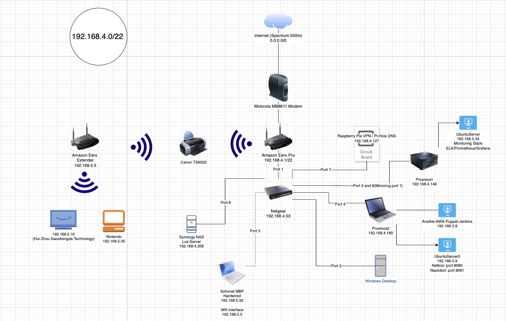
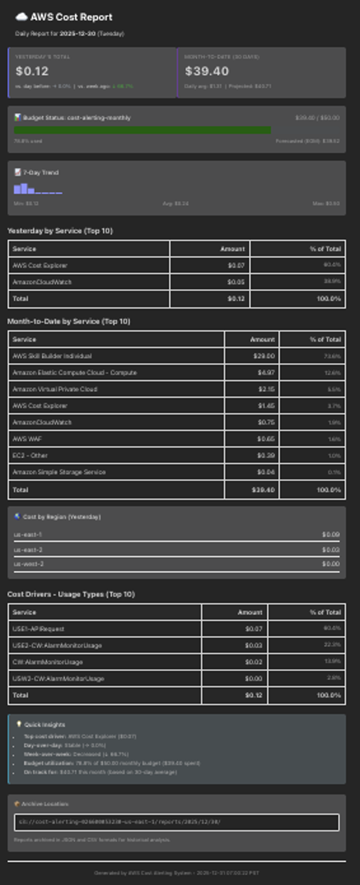

# Home Lab Documentation

Complete documentation for a production-ready home lab environment featuring network security monitoring, DNS filtering, secure remote access, infrastructure automation, observability, and cloud services.

**Author:** Alex Lux  
**Date:** December 2025  
**Environment:** Home Lab - Proxmox VE + Raspberry Pi / Linux VMs + AWS Cloud Services

> **Comprehensive Lab**: This documentation covers 8 integrated projects spanning on-premises infrastructure, cloud services, and automation tooling.

---

## 🏗️ Complete Network Diagram



*Complete network topology showing Internet connection, Eero Pro router, Netgear managed switch with port mirroring, Proxmox hosts, Security Onion VM, PiVPN/Pi-hole host, and all connected devices.*

---

## 📋 Overview

This home lab demonstrates enterprise-grade network security and infrastructure management using open-source tools and cloud services. The lab consists of **8 integrated projects** that work together to provide a comprehensive infrastructure platform covering:

### Lab Capabilities

**On-Premises Infrastructure (5 projects):**
- Network security monitoring and intrusion detection
- DNS filtering and VPN remote access
- Network documentation and IPAM/DCIM
- DevOps automation and CI/CD
- Metrics, logs, and observability

**Cloud Services (3 projects):**
- Infrastructure as Code deployments
- Serverless web applications
- Cost monitoring and alerting

**Total Infrastructure:**
- **On-Premises**: 5 VMs/hosts running 15+ services
- **Cloud**: 3 AWS projects with multiple services
- **Technologies**: 20+ different tools and platforms
- **Documentation**: 9 comprehensive writeups

- **Network Security Monitoring**: Full-packet capture and intrusion detection
- **DNS Filtering**: Network-wide ad and tracker blocking
- **Secure Remote Access**: VPN connectivity for remote network access
- **Network Documentation**: IPAM/DCIM for infrastructure management
- **DevOps Automation**: CI/CD, configuration management, and cloud integration
- **Observability & Monitoring**: Metrics, logs, and visualization platform
- **Cloud Infrastructure**: AWS EC2 game server with Infrastructure as Code
- **Serverless Applications**: AWS Lambda + CloudFront web applications
- **Cost Management**: Automated AWS cost monitoring and alerting
- **Centralized Management**: Two Proxmox virtualization hosts

---

## 🏗️ Lab Architecture

See the [Complete Network Diagram](#-complete-network-diagram) above for a visual representation of the entire lab topology.

**Key Components:**

- **Eero Router** (192.168.4.1): Gateway and DHCP server
- **Netgear Managed Switch** (192.168.4.53): Port mirroring for traffic capture
  - Port 1: Eero Router (Source for port mirroring)
  - Port 8: Proxmox Sniffer (Destination for port mirroring)
- **Proxmox Host 1** (192.168.4.146): Primary virtualization platform
  - **Security Onion VM** (192.168.4.155): IDS/NSM with full packet capture
  - **Observability Stack VM** (192.168.5.34): Prometheus, Grafana, ELK Stack
- **Proxmox Host 2** (192.168.4.180): Secondary virtualization platform
  - **DevOps Tools VM** (192.168.5.8): Ansible, AWX, Puppet & Jenkins
  - **NSOT VM** (192.168.5.9): Network Source of Truth (NetBox & Nautobot)
- **PiVPN Host** (192.168.4.127): DNS filtering and VPN
  - Pi-hole DNS (Port 53, 80 - LAN only)
  - WireGuard VPN (Port 51820/UDP - WAN exposed)

### Network Subnets

- **LAN**: 192.168.4.0/22 (covers 192.168.4.0 – 192.168.7.255)
- **VPN**: 10.155.185.0/24 (WireGuard clients)

### Quick Reference Table

| Project | Type | Location | Primary URL | Key Technology |
|---------|------|----------|-------------|----------------|
| Security Onion | On-Prem | VM (192.168.4.155) | https://192.168.4.155 | IDS/NSM |
| PiVPN + Pi-hole | On-Prem | Host (192.168.4.127) | http://192.168.4.127/admin | DNS/VPN |
| NSOT (NetBox/Nautobot) | On-Prem | VM (192.168.5.9) | http://192.168.5.9:8000 | IPAM/DCIM |
| DevOps Tools | On-Prem | VM (192.168.5.8) | http://192.168.5.8:8080 | CI/CD |
| Observability Stack | On-Prem | VM (192.168.5.34) | http://192.168.5.34:3000 | Monitoring |
| AWS Game Server | Cloud | AWS EC2 | https://games.alexflux.com | Terraform/Ansible |
| NetKnife | Cloud | AWS Lambda/CloudFront | https://tools.alexflux.com | Serverless |
| AWS Cost Alerting | Cloud | AWS Lambda | Email (7am daily) | Cost Management |

---

## 📁 Project Documentation

### 1. Security Onion 2.4.90-2 Lab Setup

**File:** `SecurityOnion_Lab_Writeup.md`

Enterprise-grade Intrusion Detection System (IDS) and Network Security Monitor (NSM) deployed as a VM on Proxmox with port mirroring for passive network traffic analysis.

**Key Features:**
- ✅ Full-packet capture (PCAP) via port mirroring
- ✅ Suricata IDS for threat detection
- ✅ Zeek NSM for network protocol analysis
- ✅ Elastic Stack (Kibana) for log visualization
- ✅ Passive monitoring (no network disruption)

**Components:**
- Security Onion 2.4.90-2 VM (16GB RAM, EVAL mode)
- Proxmox bridge configuration (Hub Mode)
- NETGEAR switch port mirroring
- Comprehensive troubleshooting guide

**Quick Start:**
1. Read `SecurityOnion_Lab_Writeup.md` for complete setup
2. Use `QUICK_REFERENCE.md` for command lookups
3. Follow step-by-step installation guide

**Prerequisites:**
- Proxmox VE 8.x
- Managed switch with port mirroring
- Minimum 16GB RAM for VM
- Two network interfaces on Proxmox host

---

### 2. PiVPN + Pi-hole DNS + VPN Stack

**File:** `PiVPN_PiHole_Lab_Writeup.md`

Network-wide ad/tracker blocking via Pi-hole DNS filtering combined with secure WireGuard VPN for remote access, running on a single Linux host.

**Key Features:**
- ✅ Network-wide DNS filtering (ad/tracker blocking)
- ✅ WireGuard VPN for secure remote access
- ✅ Minimal attack surface (only WireGuard exposed)
- ✅ Easy client provisioning (QR codes)
- ✅ Web-based management interface

**Components:**
- Pi-hole DNS server (Port 53, 80 - LAN only)
- PiVPN WireGuard server (Port 51820/UDP - WAN exposed)
- DHCP reservation for stable IP
- Router DNS configuration

**Quick Start:**
1. Read `PiVPN_PiHole_Lab_Writeup.md` for complete setup
2. Set DHCP reservation for stable IP
3. Install PiVPN (WireGuard)
4. Install Pi-hole
5. Configure router DNS

**Prerequisites:**
- Raspberry Pi or Debian/Ubuntu Linux host
- Router admin access (for DHCP reservation and port forwarding)
- Minimum 1GB RAM (2GB+ recommended)

---

### 3. Network Source of Truth (NSOT) - NetBox & Nautobot

**File:** `NSOT_NetBox_Nautobot_Lab_Writeup.md`

Containerized Network Source of Truth platforms deployed via Docker on an Ubuntu VM for comprehensive IPAM and DCIM capabilities. Provides both NetBox and Nautobot for network infrastructure documentation and management.

**Key Features:**
- ✅ IP Address Management (IPAM)
- ✅ Data Center Infrastructure Management (DCIM)
- ✅ Device and circuit documentation
- ✅ REST API for automation
- ✅ Docker-based deployment

**Components:**
- Ubuntu VM (192.168.5.9) on Proxmox Host 2 (192.168.4.180)
- NetBox (Port 8000 - LAN only)
- Nautobot (Port 8081 - LAN only)
- PostgreSQL databases
- Redis for task queues

**Quick Start:**
1. Read `NSOT_NetBox_Nautobot_Lab_Writeup.md` for complete setup
2. Create Ubuntu VM on Proxmox Host 2 (192.168.4.180)
3. Install Docker and Docker Compose
4. Clone repository: `https://github.com/alexlux58/NSOT-Network-Source-of-Truth`
5. Deploy NetBox or Nautobot using Docker Compose

**Prerequisites:**
- Proxmox VE 8.x (Host 2 at 192.168.4.180)
- Ubuntu VM (4GB+ RAM, 50GB+ storage)
- Docker and Docker Compose installed
- Git for cloning repository

**Repository:** [NSOT-Network-Source-of-Truth](https://github.com/alexlux58/NSOT-Network-Source-of-Truth)

---

### 4. DevOps Tools Stack - Ansible, AWX, Puppet & Jenkins

**File:** `DevOps_Tools_Lab_Writeup.md`

Comprehensive DevOps toolchain deployed on an Ubuntu VM providing infrastructure automation, configuration management, and CI/CD capabilities. Includes Ansible for automation, AWX (Ansible Tower) for web-based automation, AWS CLI/SDK for cloud integration, Puppet for configuration management, and Jenkins for continuous integration and deployment.

**Key Features:**
- ✅ Infrastructure as Code (Ansible playbooks)
- ✅ Web-based automation (AWX/Ansible Tower)
- ✅ Cloud automation (AWS CLI & SDK)
- ✅ Configuration management (Puppet)
- ✅ CI/CD pipelines (Jenkins)
- ✅ Integration workflows between tools

**Components:**
- Ubuntu VM (192.168.5.8) on Proxmox Host 2 (192.168.4.180)
- Ansible (Control node)
- AWX (Ansible Tower web interface)
- AWS CLI & boto3 (Python SDK)
- Puppet (Server/Agent model)
- Jenkins (Port 8080 - LAN only)

**Quick Start:**
1. Read `DevOps_Tools_Lab_Writeup.md` for complete setup
2. Create Ubuntu VM on Proxmox Host 2 (192.168.4.180)
3. Install Ansible, AWX, AWS CLI, Puppet, and Jenkins
4. Configure credentials and SSH keys
5. Create sample playbooks, manifests, and pipelines

**Prerequisites:**
- Proxmox VE 8.x (Host 2 at 192.168.4.180)
- Ubuntu VM (4GB+ RAM, 50GB+ storage)
- Internet access (for AWS API calls)
- SSH access to managed nodes (for Ansible)
- AWS account (for AWS integration)

---

### 5. Network Observability Stack

**File:** `Network_Observability_Stack_Lab_Writeup.md`

Comprehensive observability platform deployed via Docker Compose providing metrics collection, log aggregation, and visualization capabilities. Includes Prometheus for metrics, Grafana for visualization, Elasticsearch/Kibana for logs, and various exporters for monitoring.

**Key Features:**
- ✅ Metrics collection (Prometheus)
- ✅ Log aggregation (Elasticsearch + Kibana)
- ✅ Visualization dashboards (Grafana)
- ✅ Alerting (Alertmanager)
- ✅ Host and container monitoring (Node Exporter, cAdvisor)
- ✅ Uptime monitoring (Blackbox Exporter)

**Components:**
- Ubuntu VM (192.168.5.34) on Proxmox Host 1 (192.168.4.146)
- Prometheus (Port 9090 - metrics collection)
- Grafana (Port 3000 - visualization)
- Elasticsearch (Port 9200 - log storage)
- Kibana (Port 5601 - log visualization)
- Logstash + Filebeat (log processing)
- Alertmanager (Port 9093 - alerting)
- Node Exporter, cAdvisor, Blackbox Exporter

**Quick Start:**
1. Read `Network_Observability_Stack_Lab_Writeup.md` for complete setup
2. Create Ubuntu VM on Proxmox Host 1 (192.168.4.146)
3. Install Docker and Docker Compose
4. Clone repository: `https://github.com/alexlux58/Network-Observability-Stack`
5. Run `./setup.sh` and `./manage.sh start`
6. Access Grafana at http://192.168.5.34:3000

**Prerequisites:**
- Proxmox VE 8.x (Host 1 at 192.168.4.146)
- Ubuntu VM (8GB+ RAM, 100GB+ storage recommended)
- Docker and Docker Compose installed
- Git for cloning repository
- Network access to monitored hosts

**Repository:** [Network-Observability-Stack](https://github.com/alexlux58/Network-Observability-Stack)

---

### 6. AWS Infrastructure as Code Game Server

**File:** `AWS_Game_Server_Lab_Writeup.md`

Web-based game server deployed on AWS EC2 using Infrastructure as Code (Terraform) and configuration management (Ansible). Hosts multiple browser-based games accessible via a unified web interface, demonstrating modern DevOps practices and cloud infrastructure management.

**Key Features:**
- ✅ Infrastructure as Code (Terraform)
- ✅ Configuration Management (Ansible)
- ✅ Multiple browser-based games
- ✅ Automated deployment
- ✅ Cost monitoring and alerts
- ✅ Scalable architecture

**Components:**
- AWS EC2 Instance (t3.micro/t3.small)
- Terraform for infrastructure provisioning
- Ansible for configuration management
- Nginx web server
- Docker (for QuakeJS)
- Multiple games (2048, PvP, Pac-Man, Mario, QuakeJS)

**Quick Start:**
1. Read `AWS_Game_Server_Lab_Writeup.md` for complete setup
2. Configure AWS credentials and `.env` file
3. Run `make deploy` or deploy manually with Terraform + Ansible
4. Access game server at https://games.alexflux.com

**Prerequisites:**
- AWS account with active credentials
- Terraform installed
- Ansible installed
- AWS CLI configured
- SSH key pair
- IAM permissions (Admin or Power User)

**Repository:** [aws_iac-game-server](https://github.com/alexlux58/aws_iac-game-server)

---

### 7. NetKnife - Network & Security Swiss Army Knife

**File:** `NetKnife_Lab_Writeup.md`

Serverless web application providing network engineers with essential tools accessible from any browser. Combines offline browser-based tools with remote API-powered tools, all deployed on AWS using Infrastructure as Code (Terraform). Similar to CyberChef but customized for network engineering needs.

**Key Features:**
- ✅ Serverless architecture (Lambda + CloudFront)
- ✅ Offline browser-based tools (no data leaves machine)
- ✅ Remote API-powered tools (DNS, TLS, security analysis)
- ✅ Infrastructure as Code (Terraform)
- ✅ Authentication (AWS Cognito)
- ✅ Caching (DynamoDB)

**Components:**
- AWS Lambda Functions (backend APIs)
- API Gateway (HTTP API)
- AWS Cognito (authentication)
- DynamoDB (caching)
- S3 + CloudFront (frontend hosting)
- React TypeScript frontend

**Quick Start:**
1. Read `NetKnife_Lab_Writeup.md` for complete setup
2. Configure AWS credentials and `.env` file
3. Deploy infrastructure with Terraform
4. Build and deploy frontend
5. Access at CloudFront URL or custom domain

**Prerequisites:**
- AWS account with active credentials
- Terraform installed
- Node.js 18+ installed
- AWS CLI configured
- IAM permissions (Admin or Power User)
- Optional: External API keys (Shodan, VirusTotal, etc.)

**Repository:** [NetKnife](https://github.com/alexlux58/NetKnife)

---

### 8. AWS Cost Alerting System

**File:** `AWS_Cost_Alerting_Lab_Writeup.md`



*Example daily cost report email showing cost breakdown and top services.*

Automated AWS cost monitoring and alerting system that sends daily cost reports via email at 7am, providing visibility into AWS spending and helping prevent cost overruns. Uses serverless architecture with Infrastructure as Code (Terraform) for deployment.

**Key Features:**
- ✅ Daily cost reports via email (7am)
- ✅ Budget alerts and thresholds
- ✅ Top services cost breakdown
- ✅ Month-to-date and daily cost tracking
- ✅ Report archiving in S3
- ✅ Optional cost remediation

**Components:**
- AWS Lambda (cost reporter function)
- EventBridge Scheduler (daily 7am trigger)
- AWS SES (email delivery)
- S3 (report archives)
- SSM Parameter Store (configuration)
- CloudWatch Alarms (monitoring)
- AWS Budget (optional)

**Quick Start:**
1. Read `AWS_Cost_Alerting_Lab_Writeup.md` for complete setup
2. Configure AWS credentials and `terraform.tfvars`
3. Verify email addresses in SES
4. Deploy infrastructure with Terraform
5. Receive daily cost reports at 7am

**Prerequisites:**
- AWS account with active credentials
- Terraform installed
- AWS CLI configured
- IAM permissions (Admin or Power User)
- Email addresses for sender and recipient
- SES email verification

**Repository:** [AWS-ALERTING](https://github.com/alexlux58/AWS-ALERTING)

---

## 🚀 Getting Started

### Quick Links

**Essential Services:**
- [Security Onion Console](https://192.168.4.155) - Network security monitoring
- [Pi-hole Admin](http://192.168.4.127/admin) - DNS filtering dashboard
- [NetBox](http://192.168.5.9:8000) - Network documentation
- [Grafana](http://192.168.5.34:3000) - Metrics visualization
- [Jenkins](http://192.168.5.8:8080) - CI/CD platform

**Cloud Services:**
- [NetKnife](https://tools.alexflux.com) - Network tools (if deployed)
- AWS Cost Reports - Daily email at 7am

### For New Users

1. **Start with the README** (this file) to understand the overall lab architecture
2. **Review the Network Diagram** above to visualize the complete topology
3. **Choose a project** based on your goals:
   - **Network Security Monitoring**: Start with Security Onion
   - **DNS Filtering & VPN**: Start with PiVPN + Pi-hole
   - **Network Documentation**: Start with NSOT (NetBox/Nautobot)
   - **DevOps Automation**: Start with DevOps Tools (Ansible/AWS/Puppet/Jenkins)
   - **Observability & Monitoring**: Start with Network Observability Stack
   - **Cloud Infrastructure**: Start with AWS Game Server (Terraform/Ansible)
   - **Serverless Applications**: Start with NetKnife (Lambda/CloudFront)
   - **Cost Management**: Start with AWS Cost Alerting (Daily reports)
3. **Read the project writeup** from start to finish
4. **Follow step-by-step** installation instructions
5. **Use quick reference** guides for command lookups

### Recommended Deployment Order

If building the complete lab from scratch, follow this order for optimal integration:

**Phase 1: Foundation (Week 1)**
1. **Proxmox Hosts Setup**
   - Install Proxmox VE on both hosts
   - Proxmox Host 1 (192.168.4.146): Primary host
   - Proxmox Host 2 (192.168.4.180): Secondary host
   - Configure network interfaces
   - Set up bridges

2. **PiVPN + Pi-hole** ⭐ Start Here
   - Provides DNS for the lab
   - Enables secure remote access
   - Lower resource requirements
   - **Benefit**: All other services can use Pi-hole DNS

**Phase 2: Documentation & Automation (Week 2)**
3. **NSOT (NetBox/Nautobot)**
   - Document network infrastructure
   - Track IP addresses and devices
   - Lower resource requirements (4GB+ RAM)
   - **Benefit**: Document all services as you deploy them
   - **Location**: Proxmox Host 2 (192.168.4.180)

4. **DevOps Tools**
   - Infrastructure automation and configuration management
   - CI/CD pipeline capabilities
   - Cloud integration (AWS)
   - Medium resource requirements (4GB+ RAM)
   - **Benefit**: Automate future deployments

**Phase 3: Monitoring & Observability (Week 3)**
5. **Network Observability Stack**
   - Metrics and log collection
   - Visualization and dashboards
   - Alerting capabilities
   - Higher resource requirements (8GB+ RAM, 100GB+ storage)
   - **Benefit**: Monitor all services you've deployed
   - **Location**: Proxmox Host 1 (192.168.4.146)

6. **Security Onion** (Advanced - requires more resources)
   - Requires more resources (16GB+ RAM)
   - Benefits from stable DNS (Pi-hole)
   - Can monitor VPN traffic
   - Can document findings in NetBox/Nautobot
   - Can be automated via Ansible
   - **Benefit**: Complete network security visibility

**Phase 4: Cloud Services (Week 4+)**
7. **AWS Cost Alerting** ⭐ Deploy Early
   - Daily cost visibility
   - Budget monitoring
   - Cost optimization insights
   - Requires AWS account
   - **Benefit**: Monitor costs from day one

8. **AWS Game Server**
   - Infrastructure as Code practice
   - Cloud deployment experience
   - Cost-effective hosting
   - Requires AWS account
   - **Benefit**: Practice Terraform and Ansible

9. **NetKnife**
   - Serverless architecture experience
   - React/TypeScript frontend
   - Lambda function development
   - Requires AWS account
   - **Benefit**: Serverless development experience

---

## 🔗 Integration Points

### How Projects Work Together

**Pi-hole → Security Onion:**
- Security Onion can monitor DNS queries from Pi-hole
- Correlate DNS activity with network traffic
- Detect DNS-based attacks and exfiltration

**Security Onion → Pi-hole:**
- Security Onion can alert on suspicious DNS patterns
- Block malicious domains via Pi-hole blocklists
- Monitor VPN client DNS queries

**WireGuard → Security Onion:**
- Security Onion can monitor VPN traffic (if VPN subnet is in monitoring scope)
- Track remote access patterns
- Detect unauthorized VPN connections

**All Services → Proxmox:**
- Centralized virtualization platform (2 Proxmox hosts)
- Resource management and monitoring
- Backup and disaster recovery
- Proxmox Host 1 (192.168.4.146): Security Onion, Observability Stack
- Proxmox Host 2 (192.168.4.180): DevOps Tools, NSOT

**NetBox/Nautobot → All Services:**
- Document all network devices and IP addresses
- Track Security Onion VM and PiVPN host
- Source of truth for network automation
- API integration with other tools

**DevOps Tools → All Services:**
- Ansible automates configuration of all lab services
- AWX provides web-based Ansible automation interface
- Jenkins pipelines for automated deployments
- Puppet ensures consistent configurations
- AWS integration for cloud resources
- Automate Security Onion rule updates
- Automate Pi-hole blocklist updates
- Update NetBox/Nautobot via APIs

**Observability Stack → All Services:**
- Monitor all lab VMs and services via Prometheus
- Collect logs from all services via Filebeat/Logstash
- Visualize metrics and logs in Grafana and Kibana
- Alert on service issues via Alertmanager
- Track resource usage and performance
- Correlate metrics and logs for troubleshooting

**AWS Game Server → DevOps Tools:**
- Demonstrates Terraform and Ansible usage
- Can be automated via Jenkins pipelines
- Integrates with AWS services
- Shows Infrastructure as Code best practices

**NetKnife → All Services:**
- Can be used to troubleshoot network issues
- DNS lookups for lab services
- TLS certificate inspection
- IP reputation checking
- Can be monitored via Observability Stack
- Can be automated via DevOps Tools

**AWS Cost Alerting → All AWS Projects:**
- Monitors costs for all AWS services
- Tracks AWS Game Server costs (EC2, S3, data transfer)
- Tracks NetKnife Lambda costs (Lambda, API Gateway, CloudFront, DynamoDB)
- Provides daily cost visibility
- Helps prevent cost overruns
- Can be integrated with Observability Stack (CloudWatch metrics)

**Complete Integration Flow:**
```
Pi-hole (DNS) → All Services
    ↓
Security Onion (Monitoring) → Observability Stack (Metrics/Logs)
    ↓
NetBox/Nautobot (Documentation) ← DevOps Tools (Automation)
    ↓
AWS Services (Cloud) → Cost Alerting (Cost Management)
```

---

## 📊 Lab Statistics

### Hardware Resources

**Proxmox Hosts:**
- **Proxmox Host 1** (192.168.4.146): Intel NUC Mini PC
  - Multiple network interfaces
  - SSD storage
  - Hosts: Security Onion VM, Observability Stack VM
- **Proxmox Host 2** (192.168.4.180): Secondary virtualization host
  - Multiple network interfaces
  - SSD storage
  - Hosts: DevOps Tools VM, NSOT VM

**Security Onion VM:**
- 16GB RAM (EVAL mode)
- 4 CPU cores (Host type)
- 200GB SSD storage

**PiVPN Host:**
- Raspberry Pi or Linux VM
- 1-2GB RAM
- 8GB+ storage

**NSOT VM:**
- Ubuntu VM on Proxmox Host 2 (192.168.4.180)
- 4GB RAM (8GB+ recommended)
- 50GB+ storage

**DevOps Tools VM:**
- Ubuntu VM on Proxmox Host 2 (192.168.4.180)
- 4GB RAM (8GB+ recommended)
- 50GB+ storage

**Observability Stack VM:**
- Ubuntu VM on Proxmox Host 1 (192.168.4.146)
- 8GB RAM (16GB+ recommended)
- 100GB+ storage

### Network Configuration

- **LAN Subnet**: 192.168.4.0/22
- **VPN Subnet**: 10.155.185.0/24
- **Gateway**: 192.168.4.1 (Eero Router)
- **Switch**: 192.168.4.53 (NETGEAR GS308EPP)

### Service Ports

| Service | Port | Protocol | Exposure |
|---------|------|----------|----------|
| Pi-hole DNS | 53 | UDP/TCP | LAN only |
| Pi-hole Web UI | 80 | TCP | LAN only |
| WireGuard VPN | 51820 | UDP | WAN |
| Security Onion Console | 443 | TCP | LAN only |
| NetBox | 8000 | TCP | LAN only |
| Nautobot | 8081 | TCP | LAN only |
| Jenkins | 8080 | TCP | LAN only |
| Puppet Master | 8140 | TCP | LAN only |
| Grafana | 3000 | TCP | LAN only |
| Kibana | 5601 | TCP | LAN only |
| Prometheus | 9090 | TCP | LAN only |
| Elasticsearch | 9200 | TCP | LAN only |
| Alertmanager | 9093 | TCP | LAN only |

---

## 📚 Documentation Structure

```
HomeLabWriteup/
├── README.md                          # This file - Lab overview
├── SecurityOnion_Lab_Writeup.md      # Security Onion setup guide
├── PiVPN_PiHole_Lab_Writeup.md       # PiVPN + Pi-hole setup guide
├── NSOT_NetBox_Nautobot_Lab_Writeup.md  # NSOT (NetBox/Nautobot) setup guide
├── DevOps_Tools_Lab_Writeup.md       # DevOps tools (Ansible/AWS/Puppet/Jenkins) setup guide
├── Network_Observability_Stack_Lab_Writeup.md  # Observability stack setup guide
├── AWS_Game_Server_Lab_Writeup.md    # AWS Game Server (Terraform/Ansible) setup guide
├── NetKnife_Lab_Writeup.md           # NetKnife serverless app setup guide
├── AWS_Cost_Alerting_Lab_Writeup.md  # AWS Cost Alerting setup guide
├── QUICK_REFERENCE.md                 # Command cheat sheet
└── images/                            # Screenshots and diagrams
    ├── home-network-diagram.png
    ├── Port-Mirroring.png
    ├── Port-Stats.png
    ├── SecOnion-Alerts.png
    └── SecOnion-PortMirror-TCPdumpCAP.png
```

---

## ✅ Validation Checklist

### Complete Lab Validation

**Network Connectivity:**
- [ ] All devices can reach internet
- [ ] All devices can resolve DNS via Pi-hole
- [ ] Security Onion can access management network

**Pi-hole:**
- [ ] DNS queries being filtered
- [ ] Web UI accessible at http://192.168.4.127/admin
- [ ] Blocklists active and updating

**WireGuard VPN:**
- [ ] VPN clients can connect from outside
- [ ] VPN clients can reach LAN resources
- [ ] VPN clients using Pi-hole DNS (if configured)

**Security Onion:**
- [ ] Traffic visible in tcpdump
- [ ] Suricata generating alerts
- [ ] Zeek logging network connections
- [ ] Web console accessible

**Port Mirroring:**
- [ ] Switch configured correctly
- [ ] Traffic visible on Proxmox host
- [ ] Traffic visible in Security Onion VM

**NSOT (NetBox/Nautobot):**
- [ ] NetBox accessible at http://192.168.5.9:8000
- [ ] Nautobot accessible at http://192.168.5.9:8081
- [ ] Admin credentials changed from defaults
- [ ] Network devices documented
- [ ] IP addresses tracked

**DevOps Tools:**
- [ ] Jenkins accessible at http://192.168.5.8:8080
- [ ] Ansible can connect to managed nodes
- [ ] AWS CLI configured and working
- [ ] Puppet server/agent running
- [ ] Sample playbooks and pipelines created

**Observability Stack:**
- [ ] Grafana accessible at http://192.168.5.34:3000
- [ ] Kibana accessible at http://192.168.5.34:5601
- [ ] Prometheus collecting metrics
- [ ] Elasticsearch storing logs
- [ ] Node Exporter installed on monitored hosts
- [ ] Dashboards imported and working

**AWS Game Server:**
- [ ] Terraform infrastructure deployed
- [ ] Ansible configuration applied
- [ ] Game server accessible at https://games.alexflux.com
- [ ] All games loading correctly
- [ ] Cost monitoring configured
- [ ] Billing alarms set up

**NetKnife:**
- [ ] Terraform infrastructure deployed
- [ ] Lambda functions operational
- [ ] Frontend deployed to CloudFront
- [ ] Authentication working (Cognito)
- [ ] Offline tools functional
- [ ] Remote tools accessible
- [ ] Custom domain configured (if applicable)

**AWS Cost Alerting:**
- [ ] Terraform infrastructure deployed
- [ ] Lambda function operational
- [ ] EventBridge Scheduler enabled
- [ ] Email addresses verified in SES
- [ ] Daily reports being received
- [ ] Budget alerts configured
- [ ] CloudWatch alarms monitoring system

---

## 🛠️ Maintenance & Operations

### Regular Tasks

**Weekly:**
- Review Security Onion alerts
- Check Pi-hole query logs for anomalies
- Verify VPN client connections
- Monitor disk usage

**Monthly:**
- Update Security Onion rules: `sudo so-rule-update`
- Update Security Onion system: `sudo soup`
- Review Pi-hole blocklists
- Backup configurations
- Backup NetBox/Nautobot databases
- Update Docker images for NSOT services
- Backup Jenkins and Puppet configurations
- Update Ansible, AWS CLI, Puppet, and Jenkins
- Review Observability Stack disk usage
- Clean old metrics and logs (if needed)
- Update Grafana dashboards
- Review AWS costs and usage
- Update game server if needed
- Backup game server configurations
- Monitor NetKnife Lambda invocations
- Review CloudFront cache hit rates
- Update NetKnife tools if needed
- Review daily cost reports
- Check AWS budget status
- Monitor cost trends

**As Needed:**
- Add new VPN clients: `pivpn add`
- Add custom Pi-hole blocklists
- Tune Security Onion rules
- Review and archive old logs

### Monitoring

**Pi-hole:**
- Web UI: http://192.168.4.127/admin
- Live logs: `sudo pihole -t`
- Status: `pihole status`

**WireGuard:**
- Connected clients: `pivpn -c`
- Interface status: `sudo wg show`
- Service status: `sudo systemctl status wg-quick@wg0`

**Security Onion:**
- Web console: https://192.168.4.155
- Service status: `sudo so-status`
- Logs: `/var/log/suricata/`, `/var/log/zeek/`

**NetBox:**
- Web UI: http://192.168.5.9:8000
- Service status: `docker compose ps` (in netbox-docker directory)
- Logs: `docker compose logs -f netbox`

**Nautobot:**
- Web UI: http://192.168.5.9:8081
- Service status: `docker compose ps` (in nautobot-docker directory)
- Logs: `docker compose logs -f nautobot`

**DevOps Tools:**
- Jenkins: http://192.168.5.8:8080
- Ansible: `ansible --version`, `ansible all -m ping`
- AWS CLI: `aws --version`, `aws sts get-caller-identity`
- Puppet: `sudo systemctl status puppetserver`, `sudo puppet agent --test`

**Observability Stack:**
- Grafana: http://192.168.5.34:3000
- Kibana: http://192.168.5.34:5601
- Prometheus: http://192.168.5.34:9090
- Elasticsearch: `curl http://192.168.5.34:9200`
- Service status: `./manage.sh status` (in repository directory)
- Logs: `./manage.sh logs [service-name]`

**AWS Services:**
- AWS Game Server: https://games.alexflux.com
- NetKnife: https://tools.alexflux.com
- AWS Cost Alerting: Check email inbox (7am daily)

---

## 🎯 Use Cases & Demonstrations

### Skills & Capabilities

This lab covers:

1. **Network Architecture Design**
   - Secure service boundaries
   - Minimal attack surface
   - Proper network isolation

2. **Security Operations**
   - Intrusion detection and monitoring
   - DNS filtering and threat blocking
   - Secure remote access

3. **Infrastructure Management**
   - Virtualization platform administration
   - Service deployment and configuration
   - Network documentation and IPAM/DCIM
   - Infrastructure as Code and automation
   - CI/CD pipeline development
   - Troubleshooting and maintenance

4. **Operational Excellence**
   - Log analysis and interpretation
   - Alert validation and response
   - Documentation and knowledge transfer

### Learning Outcomes

- **Network Security**: IDS/NSM deployment and operation
- **DNS Management**: Filtering, blocking, and monitoring
- **VPN Technologies**: WireGuard configuration and client management
- **Network Documentation**: IPAM/DCIM with NetBox and Nautobot
- **DevOps Automation**: Ansible, Puppet, Jenkins, and AWS integration
- **Observability**: Metrics collection, log aggregation, and visualization
- **Cloud Infrastructure**: AWS EC2, Terraform, and Infrastructure as Code
- **Serverless Architecture**: AWS Lambda, API Gateway, and CloudFront
- **Web Development**: React, TypeScript, and modern frontend frameworks
- **Containerization**: Docker deployment and management
- **Virtualization**: Proxmox VM management and networking
- **Cost Management**: AWS cost monitoring and optimization
- **Troubleshooting**: Network, service, and configuration debugging

### Technology Stack Summary

**Infrastructure & Virtualization:**
- Proxmox VE (Hypervisor)
- Docker & Docker Compose (Containerization)
- Linux (Ubuntu, Debian, Raspberry Pi OS)

**Network Security:**
- Security Onion (IDS/NSM)
- Suricata (Intrusion Detection)
- Zeek (Network Analysis)
- Pi-hole (DNS Filtering)
- WireGuard (VPN)

**DevOps & Automation:**
- Ansible (Configuration Management)
- AWX (Ansible Tower - Web-based Automation)
- Puppet (Configuration Management)
- Jenkins (CI/CD)
- Terraform (Infrastructure as Code)
- AWS CLI & SDK (Cloud Automation)

**Monitoring & Observability:**
- Prometheus (Metrics)
- Grafana (Visualization)
- Elasticsearch (Log Storage)
- Kibana (Log Analysis)
- Logstash & Filebeat (Log Processing)
- Alertmanager (Alerting)

**Network Documentation:**
- NetBox (IPAM/DCIM)
- Nautobot (IPAM/DCIM)

**Cloud Services (AWS):**
- EC2 (Compute)
- Lambda (Serverless)
- API Gateway (API Management)
- CloudFront (CDN)
- S3 (Storage)
- DynamoDB (Database)
- SES (Email)
- EventBridge (Scheduling)
- Cognito (Authentication)
- Cost Explorer (Cost Analysis)

**Web Technologies:**
- React (Frontend Framework)
- TypeScript (Programming Language)
- Nginx (Web Server)

---

## 🆘 Troubleshooting

### Quick Reference

- **Security Onion Issues**: See `SecurityOnion_Lab_Writeup.md` → Troubleshooting Guide
- **PiVPN/Pi-hole Issues**: See `PiVPN_PiHole_Lab_Writeup.md` → Troubleshooting Playbook
- **NSOT Issues**: See `NSOT_NetBox_Nautobot_Lab_Writeup.md` → Troubleshooting
- **DevOps Tools Issues**: See `DevOps_Tools_Lab_Writeup.md` → Troubleshooting
- **Observability Stack Issues**: See `Network_Observability_Stack_Lab_Writeup.md` → Troubleshooting
- **AWS Game Server Issues**: See `AWS_Game_Server_Lab_Writeup.md` → Troubleshooting
- **NetKnife Issues**: See `NetKnife_Lab_Writeup.md` → Troubleshooting
- **AWS Cost Alerting Issues**: See `AWS_Cost_Alerting_Lab_Writeup.md` → Troubleshooting
- **Command Lookups**: See `QUICK_REFERENCE.md`
- **Network Issues**: Check port mirroring, bridge configuration, firewall rules

### Common Issues

**No traffic in Security Onion:**
- Check bridge ageing (should be 0)
- Verify port mirroring on switch
- Check promiscuous mode

**Pi-hole not blocking:**
- Verify router DNS points to Pi-hole
- Check client is using Pi-hole DNS
- Review Pi-hole logs

**VPN won't connect:**
- Verify port forward (UDP 51820)
- Check firewall rules
- Confirm public IP/DDNS

---

## 📝 Notes

- All configuration examples are based on a home lab environment
- IP addresses and network ranges can be adjusted for your environment
- The guides document real troubleshooting scenarios encountered during setup
- Screenshots and diagrams are included where helpful

---

## 🔮 Future Enhancements

### Planned Additions

- **Unbound**: Local recursive DNS resolver for Pi-hole
- **Second Pi-hole**: High availability for DNS
- **Automated Backups**: Configuration and log backups
- **SIEM Integration**: Enhanced log correlation
- **Additional AWS Services**: Expand cloud infrastructure
- **Kubernetes**: Container orchestration platform
- **GitLab**: Self-hosted Git repository and CI/CD

### Integration Ideas

- Export Pi-hole metrics to Prometheus
- Correlate Security Onion alerts with Pi-hole DNS queries
- Monitor VPN connection patterns in Security Onion
- Automated blocklist updates based on Security Onion alerts
- Document all lab infrastructure in NetBox/Nautobot
- API integration between Security Onion and NetBox/Nautobot
- Automated IP address tracking and allocation
- Ansible playbooks for all lab services
- Jenkins pipelines for automated deployments
- Puppet manifests for configuration enforcement
- AWS integration for hybrid cloud scenarios
- Monitor all lab services via Observability Stack
- Correlate Security Onion alerts with metrics
- Track Pi-hole DNS query patterns
- Monitor DevOps pipeline performance
- Visualize network traffic patterns
- Deploy and manage cloud infrastructure
- Practice Infrastructure as Code
- Automate cloud deployments
- Build serverless applications
- Develop React/TypeScript frontends
- Integrate multiple AWS services
- Create custom network/security tools
- Monitor and manage cloud costs
- Automate cost reporting and alerting
- Implement budget management

---

## 📖 How to Use This Documentation

1. **First-time setup**: Read project writeups from start to finish
2. **During setup**: Keep `QUICK_REFERENCE.md` open for command lookups
3. **Troubleshooting**: Refer to troubleshooting sections in project writeups
4. **Daily operations**: Use quick reference guides for common tasks
5. **Learning**: Review architecture diagrams and integration points

---

## 🎓 Learning Resources

### Official Documentation

- [Security Onion Documentation](https://docs.securityonion.net/)
- [Pi-hole Documentation](https://docs.pi-hole.net/)
- [PiVPN Documentation](https://github.com/pivpn/pivpn)
- [WireGuard Documentation](https://www.wireguard.com/)
- [NetBox Documentation](https://docs.netbox.dev/)
- [Nautobot Documentation](https://docs.nautobot.com/)
- [NSOT Repository](https://github.com/alexlux58/NSOT-Network-Source-of-Truth)
- [Ansible Documentation](https://docs.ansible.com/)
- [AWS CLI Documentation](https://docs.aws.amazon.com/cli/)
- [Puppet Documentation](https://puppet.com/docs/)
- [Jenkins Documentation](https://www.jenkins.io/doc/)
- [Prometheus Documentation](https://prometheus.io/docs/)
- [Grafana Documentation](https://grafana.com/docs/)
- [Elasticsearch Documentation](https://www.elastic.co/guide/en/elasticsearch/reference/current/index.html)
- [Network Observability Stack Repository](https://github.com/alexlux58/Network-Observability-Stack)
- [Terraform Documentation](https://www.terraform.io/docs)
- [AWS Game Server Repository](https://github.com/alexlux58/aws_iac-game-server)
- [AWS Lambda Documentation](https://docs.aws.amazon.com/lambda/)
- [AWS API Gateway Documentation](https://docs.aws.amazon.com/apigateway/)
- [AWS CloudFront Documentation](https://docs.aws.amazon.com/cloudfront/)
- [NetKnife Repository](https://github.com/alexlux58/NetKnife)
- [AWS Cost Explorer API](https://docs.aws.amazon.com/cost-management/latest/APIReference/API_GetCostAndUsage.html)
- [AWS SES Documentation](https://docs.aws.amazon.com/ses/)
- [EventBridge Scheduler Documentation](https://docs.aws.amazon.com/scheduler/)
- [AWS Cost Alerting Repository](https://github.com/alexlux58/AWS-ALERTING)

### Community Resources

- Security Onion Slack: #securityonion
- Pi-hole Discourse: https://discourse.pi-hole.net/
- PiVPN GitHub Issues: https://github.com/pivpn/pivpn/issues
- NetBox Community: https://netbox.dev/community/
- Ansible Community: https://www.ansible.com/community
- Prometheus Community: https://prometheus.io/community/
- Grafana Community: https://community.grafana.com/

---

**Ready to start?** Choose a project above and begin with its detailed writeup!

---

## 📊 Project Summary

| # | Project | Type | Location | Primary Service | Key Technologies |
|---|---------|------|----------|-----------------|------------------|
| 1 | Security Onion | On-Prem | VM (192.168.4.155) | https://192.168.4.155 | IDS/NSM, Elastic Stack, Suricata, Zeek |
| 2 | PiVPN + Pi-hole | On-Prem | Host (192.168.4.127) | http://192.168.4.127/admin | DNS, WireGuard, Pi-hole |
| 3 | NSOT | On-Prem | VM (192.168.5.9) | http://192.168.5.9:8000 | NetBox, Nautobot, Docker, PostgreSQL |
| 4 | DevOps Tools | On-Prem | VM (192.168.5.8) | http://192.168.5.8:8080 | Ansible, AWX, Puppet, Jenkins, AWS CLI |
| 5 | Observability Stack | On-Prem | VM (192.168.5.34) | http://192.168.5.34:3000 | Prometheus, Grafana, ELK Stack |
| 6 | AWS Game Server | Cloud | AWS EC2 | https://games.alexflux.com | Terraform, Ansible, Nginx, Docker |
| 7 | NetKnife | Cloud | AWS Lambda/CF | https://tools.alexflux.com | Serverless, React, TypeScript |
| 8 | AWS Cost Alerting | Cloud | AWS Lambda | Email (7am daily) | Lambda, SES, EventBridge, Cost Explorer |

---

**Last Updated:** December 2025  
**Total Projects:** 8 (5 on-premises + 3 cloud)  
**Documentation Files:** 9 (8 project writeups + README)  
**Technologies:** 30+ tools and platforms  
**Total Services:** 20+ running services
